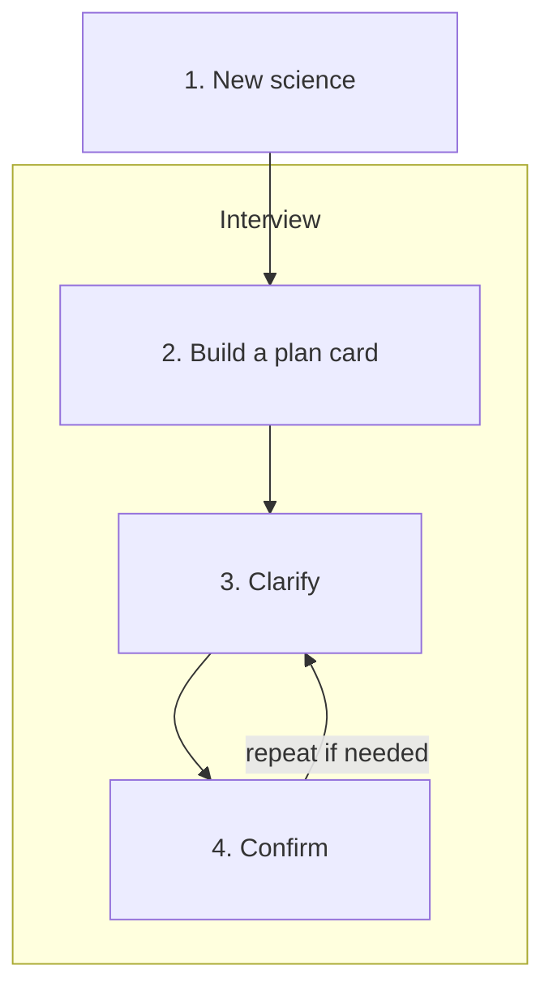

# Flow

How a request moves through Malka. This file will grow; the Interview is what is drawn so far.

**New science** sits outside the Interview. A different formula or a new cutoff is new science: it starts a new Interview.

Inside **Interview**, the three beats run in order: build a Plan Card, then Clarify, then Confirm. Confirm can send the work back to Clarify and then forward again until the user approves.
