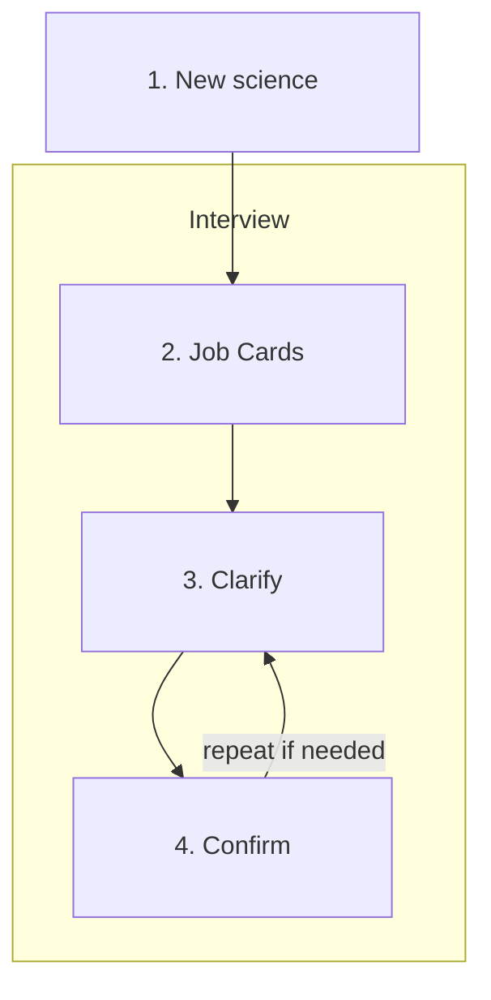

# Flow

How a request moves through Malka. This file will grow; the Interview is what is drawn so far.

**New science** sits outside the Interview. A different formula or a new cutoff is new science: it starts a new Interview.

Inside **Interview**, Malka creates one Job Card per job-folder, then Clarifies and Confirms them. Confirm can return affected Job Cards to Clarify until the user approves.
